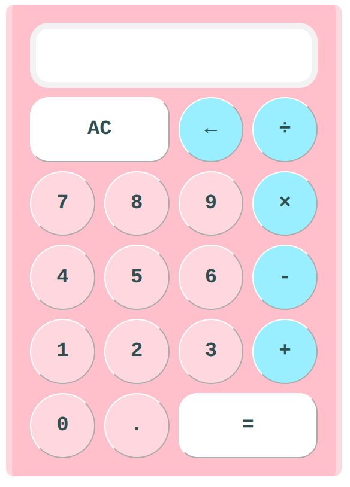

# calculator

A 4-function calculator - The final project in the The Odin Project 'Foundations' curriculum! 

<strong>Functionality</strong>: Supports doing math with the 4 basic operations, Floating point numbers are supported to 3 decimal places. There is keyboard support, a backspace button, and a Clear All button. Numbers whose integer part exceeds 15 digits are written in exponential notation as to not overflow the display and to conceal precision errors that occur at numbers of that magnitude. 

<strong>Caveats</strong>: Does not offer correctness for arbitrary precision arithmetic; might behave oddly at numbers at and around the ± safe integer limits. Does not support entering negative numbers directly, though they still can be generated. 

## Reflection
This one exercised almost all major concepts I had learned up to this point in HTML, CSS, and Javascript. This one was quite difficult, most notably because of figuring out how to program the logic for the calculator and testing it comprehensively.

How I approached programming the logic was oscillating between drawing flowcharts, programming, and testing. The flowcharts I draw (for [example](https://github.com/Julia-1439/calculator/blob/main/images/flow-chart.png)) depict 'states' of the calculator as determined by the internal variables' values, and arrows connecting them representing button presses from the user. I've probably drew at least five flowcharts throughout the course of this, incrementally refining them until it fully represented my calculator and was bug-free. 

Drawing flowcharts was crucial in testing to make sure the calculator behaved correctly in all major cases and edge cases. 

Git branching proved to be useful again to help guide my development by enforcing what feature I was working on at any given time. The power of a good commit history also showed itself, when I was having trouble recalling why I made a certain change; [this commit message](https://github.com/Julia-1439/calculator/commit/c88202bf7f84f3796e8c75303a1a66b6acef7dc3) helped me understand why. 

This project was also an exercise in patience and perseverance. I wasn't excited about every single part of this project, but that need not be true to be a developer. And when my code was buggy and I had to refactor my whole solution, I just had to take it one step at a time and not rush myself, as frustrated as I was. 

Approximate Time Spent: 
- Logic: 19:05 hours
- Styling: 5:45 hours
- Extra Credit: 7:20 hours
- Clean Up: 1:50 hours
- <strong>Total</strong>: 34:00 hours

A lot of time was spent on ensuring my commits were modular and commit messages & explanations were quality. Using `git add --patch` for the former was very useful. Perhaps I spent too much time on this, but I feel I will get better with time deciding what to commit and what not to. 

Overall, I am really happy with how this turned out! The finished product is incredibly gratifying to look at and play with. All the planning, research, testing, bug-fixing, and perseverence paid off, and I'm addicted ;)

### Post-Project Questions
These are my questions after completing the project. Perhaps I'll have answers to these as my knowledge increases! 
1. How else can I implement keyboard input? As it is, I create "dummy" click events when a key is pressed which feels hacky, so I wonder if there is a better way. Perhaps you can change the arguments of the event handlers to not take an event but rather its key, then call the handlers from a wrapper function from both the keydown and click events. 
2. Is there a way to achieve my current calculator layout without specifying the pixel dimensions of the buttons explicitly? Perhaps using calc(). 
3. How would I revise the styling to use border-box for the calculator instead of the current content-box? 
4. How is the readability and structure of the Javascript code? 

## Definitions
The following are terms we use in our commits and comments (starting in 
commit afb25e1). Each `*` indicates an arbitrary operator. 
* <strong>Equals Calculation</strong>: a user input sequence of the form `A * B =`
* <strong>Running Calculation</strong>: a user input sequence of the form `A * B *` 
* <strong>Handoff Calculation</strong>: a user input sequence of the form `A * B = *` 
* `equalsMode` variable: This variable is set to true only when the = button is pressed and is used only to handle the Handoff Calculation case. 
* Current Operand: either `operandA` or `operandB`; the operand to be updated when the user presses a digit. 

## Sources of Help
These are helpful threads I consulted for help over the course of developing this project. Note that most documentation I looked at is omitted due to how many I look at. 
* [StackOverflow: Two ways to round a number in JS and cases of error due to float imprecision:](https://stackoverflow.com/a/12830454/22151685) 

* [StackOverflow: Buttons & Inheritance](https://stackoverflow.com/questions/76109685/why-do-input-and-button-not-inherit-in-css)

* [StackOverflow: Adding multiple event listeners](https://stackoverflow.com/questions/58127282/how-we-can-add-two-event-listeners-click-and-keydown-in-javascript)

* [MDN: Max Safe Integer](https://developer.mozilla.org/en-US/docs/Web/JavaScript/Reference/Global_Objects/Number/MAX_SAFE_INTEGER) 

* [StackOverflow: Conditionally initializing a constant in Javascript](https://stackoverflow.com/questions/38765194/conditionally-initializing-a-constant-in-javascript)