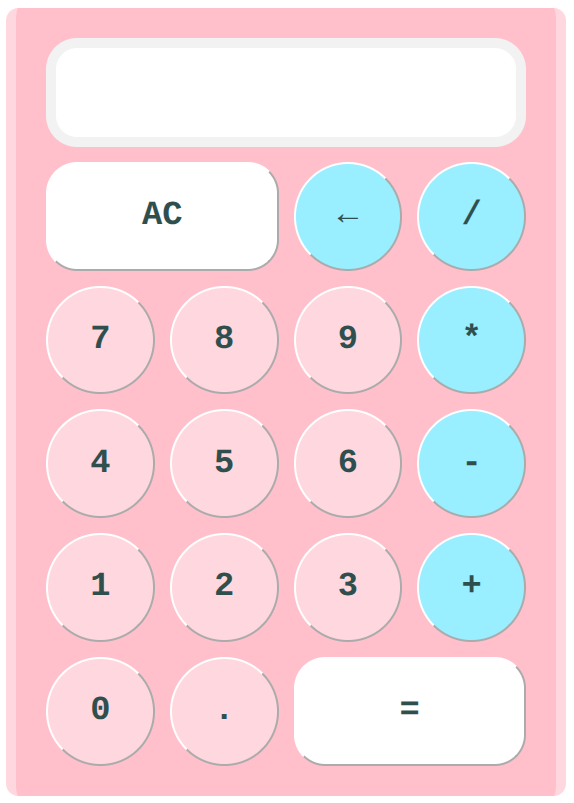

# calculator

The final project in the The Odin Project 'Foundations' curriculum! This one exercised almost all major concepts I had learned up to this point in HTML, CSS, and Javascript. This one was quite difficult, most notably because of figuring out how to program the logic for the calculator and testing it comprehensively. 

How I approached programming the logic was oscillating between drawing flowcharts, programming, and testing. The flowcharts I draw (for [example](https://github.com/Julia-1439/calculator/blob/main/flow-chart.png)) depict 'states' of the calculator as determined by the internal variables' values, and arrows connecting them representing button presses from the user. I've probably drew at least five flowcharts throughout the course of this, incrementally refining them until it fully represented my calculator and was bug-free. 

Drawing flowcharts was crucial in testing to make sure the calculator behaved correctly in all major cases and edge cases. 

Git branching proved to be useful again to help guide my development by enforcing what feature I was working on at any given time. The power of a good commit history also showed itself, when I was having trouble recalling why I made a certain change; [this commit message](https://github.com/Julia-1439/calculator/commit/c88202bf7f84f3796e8c75303a1a66b6acef7dc3) helped me understand why. 

This project was also an exercise in patience and perseverance. I wasn't excited about every single part of this project, but that need not be true to be a developer. And when my code was buggy and I had to refactor my whole solution, I just had to take it one step at a time and not rush myself, as frustrated as I was. 

Approximate Time spent: 
- Logic: 16:20 hours
- Styling: 5:30 hours
- Total: 23:45 hours
- Extra Credit: 1:55 hours and counting

A considerable, but not overwhelming, amount of time was spent on ensuring my commits were modular and commit messages were quality. Using `git add --patch` for the former was very useful. 

## Definitions
The following are terms we use in our commits and comments (starting in 
commit afb25e1). Each `*` indicates an arbitrary operator. 
* <b>Equals Calculation</b>: a user input sequence of the form `A * B =`
* <b>Running Calculation</b>: a user input sequence of the form `A * B *` 
* <b>Handoff Calculation</b>: a user input sequence of the form `A * B = *` 
* `resultMode` variable: This variable is set to true only when the = button is pressed and is used only in the Handoff Calculation case. 
* Current Operand: either `operandA` or `operandB`; the operand to be updated when the user presses a digit. 

## Sources of Help
These are helpful threads I consulted for help over the course of developing this project. Note that documentation is omitted from this due to how many I look at. 
* [StackOverflow: Two ways to round a number in JS and cases of error due to float imprecision:](https://stackoverflow.com/a/12830454/22151685) 

* [StackOverflow: Buttons & Inheritance](https://stackoverflow.com/questions/76109685/why-do-input-and-button-not-inherit-in-css)